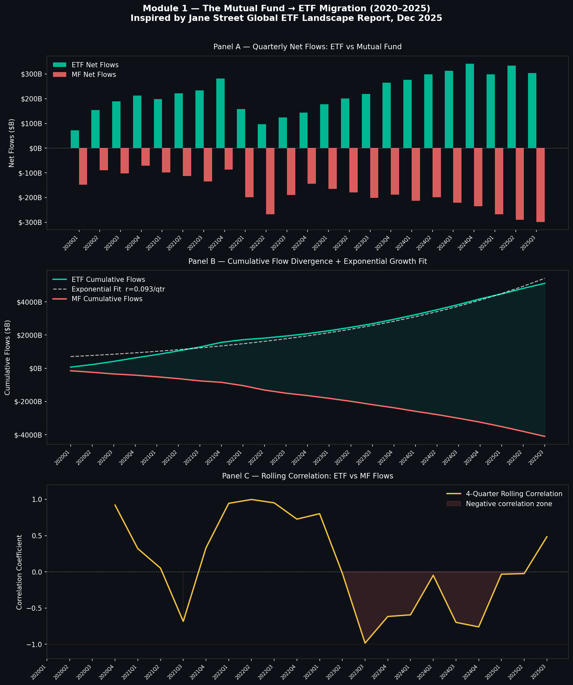
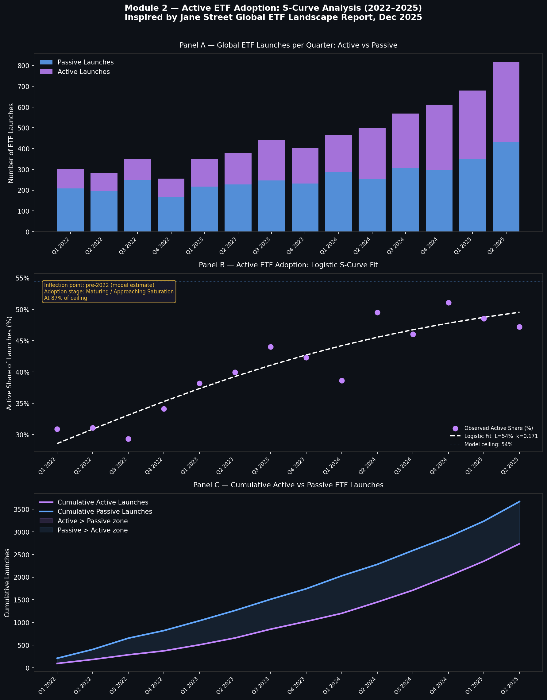
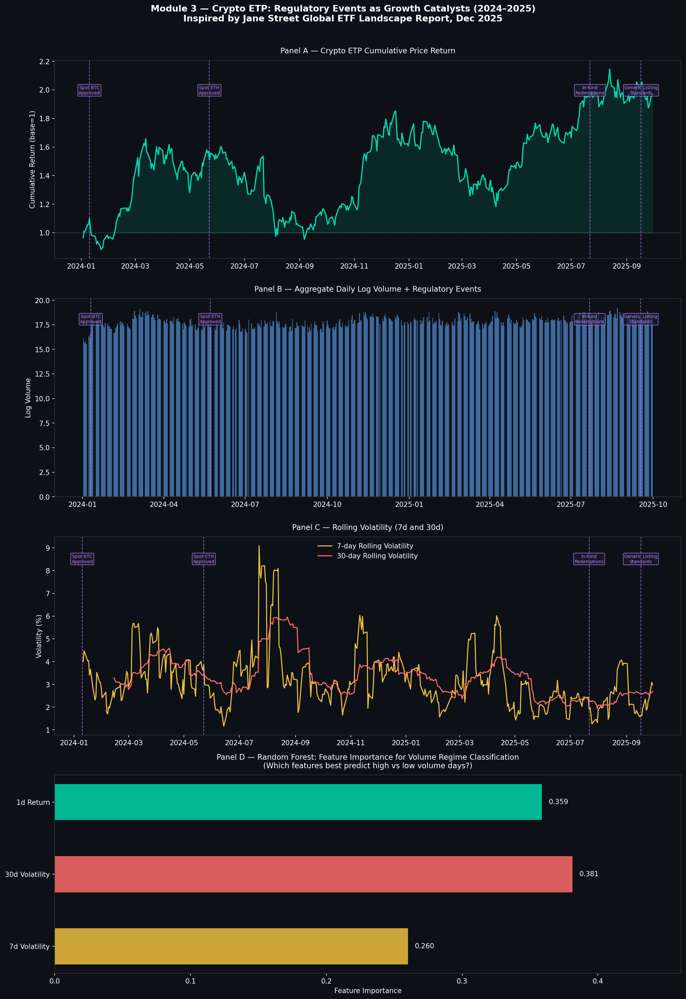

# ETF Industry Dynamics: Growth, Migration & Structural Shifts (2020–2025)


---

## Overview

This project is an empirical investigation into three structural shifts reshaping
the global ETF industry, independently motivated by Jane Street's December 2025
report *"Global ETF Landscape: Assessing the Likely Tailwinds for 2026 Growth"*.

Rather than accepting the report's narrative at face value, this study independently
reconstructs and tests its core empirical claims using publicly available data —
treating the report as a set of hypotheses to verify quantitatively.

The analysis is structured around three research modules, each applying a
progressively more formal analytical lens: growth modelling, adoption curve
fitting, statistical event studies, and exploratory machine learning.

---

## Research Questions

1. **Is the migration from mutual funds to ETFs exponential in nature, and are
   MF outflows structurally linked to ETF inflows?**

2. **Does active ETF adoption follow a logistic S-curve, and where does the
   industry currently sit in that adoption cycle?**

3. **Do regulatory approvals act as statistically significant catalysts for
   crypto ETP volume growth, and which features best predict high-volume
   trading regimes?**

---

## Data Sources

| Dataset | Source |
|---------|--------|
| ETF & Mutual Fund quarterly flows | ICI / FRED |
| ETF launch counts (active vs passive) | Jane Street report (p.3 table) |
| Crypto ETP prices and volumes | yfinance (IBIT, FBTC, GBTC, ETHA, FETH) |
| US retirement assets | ICI Factbook |

---

## Methodology & Modules

### Module 1 — The Mutual Fund → ETF Migration

**Approach:**
- Quarterly net flow data for both ETFs and mutual funds from 2020–2025
- Fitted an exponential growth model to cumulative ETF flows:
  `AUM(t) = A · e^(rt)` using log-linear regression
- Computed rolling 4-quarter correlation between ETF inflows and MF outflows

**Key Findings:**
- ETF cumulative flows grow at **r = 0.093 per quarter** — implying a
  doubling time of **7.5 quarters**
- Rolling correlation turns **negative post-2023**, confirming that MF
  outflows and ETF inflows have become inversely linked — money is
  structurally rotating from one vehicle to the other, not just growing
  independently



---

### Module 2 — Active ETF Adoption: S-Curve Analysis

**Approach:**
- Quarterly active vs passive ETF launch data from Q1 2022 to Q2 2025
- Fitted a logistic growth curve to the active share of total launches:
  `f(t) = L / (1 + e^(-k(t - t₀)))`
- Estimated ceiling L, growth rate k, and inflection point t₀ using
  nonlinear least squares via `scipy.optimize.curve_fit`
- Interpreted the current position relative to the adoption ceiling

**Key Findings:**
- Model estimates a ceiling of **L = 54%** for active ETF launch share
- Current active share at **47.2%** — already at **87% of the ceiling**
- Inflection point estimated pre-2022, meaning the industry is in the
  **maturing phase** of the adoption S-curve, not early-stage growth
- This challenges the narrative of explosive future growth — the structural
  shift toward active ETFs is already largely priced into launch behaviour



---

### Module 3 — Crypto ETP: Regulatory Events as Growth Catalysts

**Approach:**
- Daily price and volume data for 5 major crypto ETPs (IBIT, FBTC,
  GBTC, ETHA, FETH) from January 2024 to October 2025
- Event study methodology: 30-day pre/post windows around each
  regulatory approval date
- Computed abnormal log volume = post-event mean minus pre-event mean
- Two-sample t-tests to assess statistical significance
- Random Forest classifier trained to predict high vs low volume regimes
  using rolling volatility and daily returns as features

**Regulatory Events Studied:**

| Event | Date | Abnormal Volume | p-value | Significant |
|-------|------|----------------|---------|-------------|
| Spot BTC Approved | 2024-01-10 | +1.58 | 0.000 | ✅ Yes |
| Spot ETH Approved | 2024-05-23 | -0.24 | 0.013 | ✅ Yes |
| In-Kind Redemptions | 2025-07-22 | +0.27 | 0.003 | ✅ Yes |
| Generic Listing Standards | 2025-09-17 | -0.07 | 0.508 | ❌ No |

**Key Findings:**
- Spot Bitcoin approval was the **largest single regulatory catalyst**
  (+1.58 log volume units, p < 0.001)
- Spot ETH approval produced a **negative abnormal volume** — suggesting
  capital rotated from existing BTC ETPs into ETH products rather than
  fresh inflows entering the market
- Generic Listing Standards showed **no significant volume impact** —
  consistent with the market having already priced in regulatory easing
- Random Forest classifier achieved **36% accuracy** on the test set,
  suggesting short-term volatility and returns alone are insufficient
  predictors of volume regimes — a finding that motivates more
  sophisticated time-series modelling



---

## Repository Structure
```
etf-industry-dynamics/
├── main.py                          # Runs all modules end to end
├── requirements.txt
├── src/
│   ├── data_loader.py               # All data loading functions
│   ├── module1_mf_etf_migration.py  # Exponential fit, rolling correlation
│   ├── module2_active_passive.py    # Logistic S-curve fitting
│   └── module3_crypto_events.py     # Event study, t-tests, Random Forest
├── data/
│   ├── raw/                         # Source data (not tracked by Git)
│   └── processed/                   # Cleaned data (not tracked by Git)
├── outputs/
│   ├── figures/                     # All output charts
│   └── tables/                      # Summary statistics tables
└── reports/
    └── methodology_notes.md         # Design decisions and reasoning
```

---

## How to Run
```bash
# Clone the repository
git clone https://github.com/nikhilsudan/etf-industry-dynamics.git
cd etf-industry-dynamics

# Create and activate virtual environment
python3 -m venv venv
source venv/bin/activate

# Install dependencies
pip install -r requirements.txt

# Run the full pipeline
python main.py
```

> **Note on data:** Raw CSV files are not tracked by Git. See
> `reports/methodology_notes.md` for exact download instructions
> for each data source.

---

## Limitations

- Flow data for Modules 1 and 2 uses quarterly granularity — intra-quarter
  dynamics are not captured
- The logistic S-curve in Module 2 is fit on only 14 data points, making
  the ceiling estimate sensitive to recent quarters
- Crypto ETP event study uses log volume as a proxy for inflows — actual
  AUM data would provide stronger evidence
- The Random Forest classifier uses only three features on a small test set;
  accuracy of 36% reflects these constraints honestly rather than being
  treated as a prediction tool
- All flow data is approximated from public sources; institutional-grade
  analysis would require Bloomberg or Morningstar terminal access

---

## Future Extensions

- Factor model decomposition of active ETF returns to assess whether
  outperformance is genuine alpha or factor exposure
- Time-series econometrics (VAR, Granger causality) to formally test
  lead-lag relationships between MF outflows and ETF inflows
- Stochastic volatility modelling of crypto ETP prices around event windows
- Expanding the retirement assets module once 2026 annual data is available

---

## Skills & Concepts Demonstrated

- Exponential growth modelling and log-linear regression
- Logistic S-curve fitting using nonlinear least squares
- Financial event study methodology
- Two-sample t-tests and statistical significance testing
- Random Forest classification and feature importance interpretation
- Time-series data handling and financial data pipelines
- Reproducible research structure

---

## Inspiration

This project was directly motivated by reading Jane Street's December 2025
report *"Global ETF Landscape: Assessing the Likely Tailwinds for 2026 Growth"*
by Jessica Clancy and Diwa Cody. The report identifies ETF share class approvals,
crypto ETP expansion, and retirement plan inclusion as the three key tailwinds
for 2026. This project attempts to quantitatively ground those narratives in
publicly available data.

---

## License

MIT License